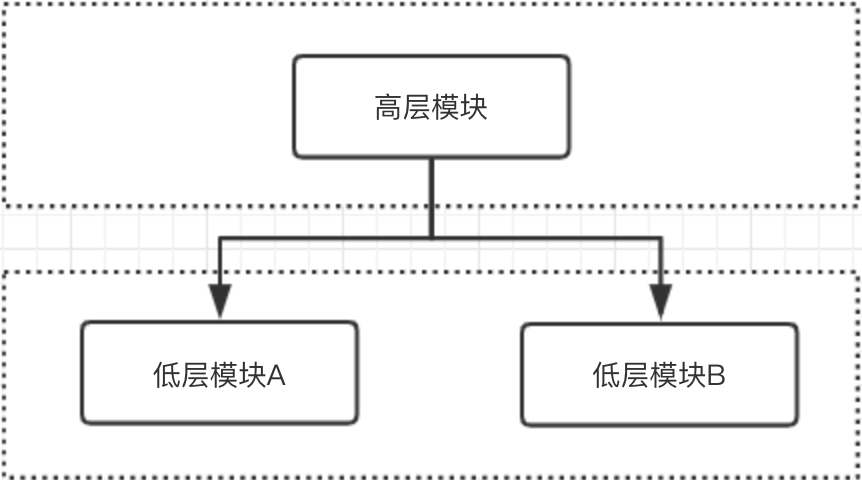
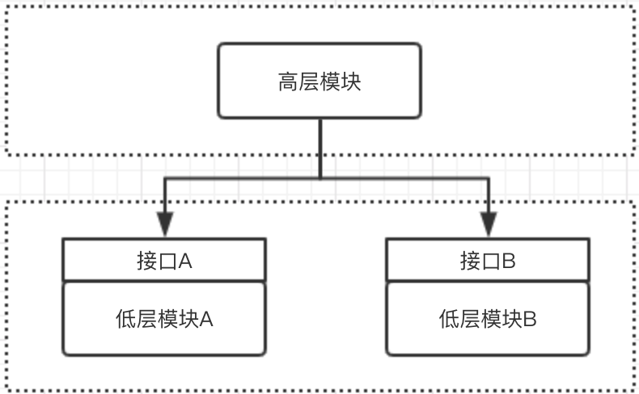
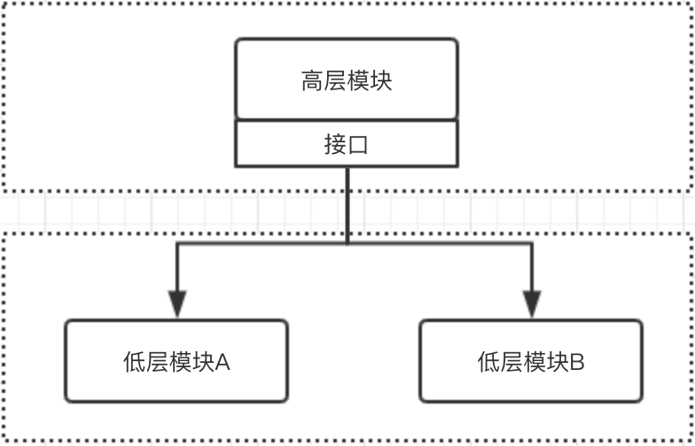

> 理解DIP、IOC、DI及IOC容器

<!-- more -->

## DIP

DIP(Dependence Inversion Principle)即依赖倒置原则，是一种抽象的软件架构设计的原则，其有两个特点：

- 高层模块不应依赖于低层模块，两者应该依赖于抽象
- 抽象不应该依赖于实现，实现应该依赖于抽象

举例子对比一下依赖倒置与依赖无倒置，代码使用SpringBoot风格：

### 依赖无倒置

这种明显高层模块已经依赖于低层模块，不满足`高层模块不应依赖于低层模块，两者应该依赖于抽象`的特点。

示例代码如下：

controller层使用

### 依赖倒置

