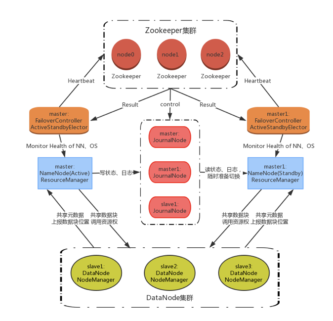
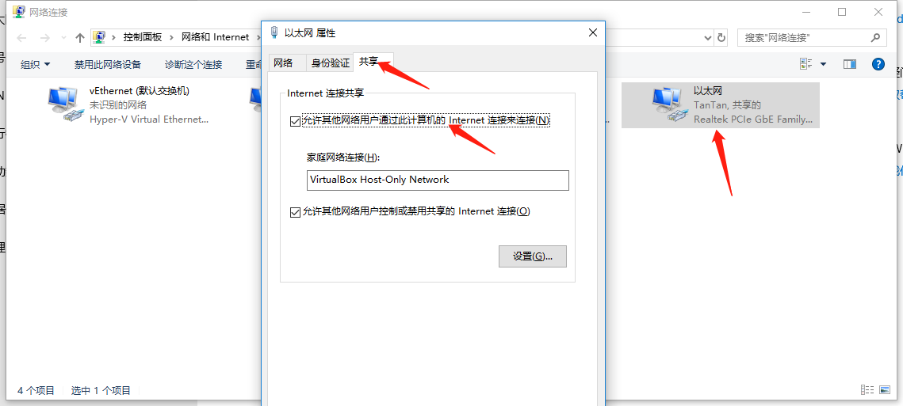
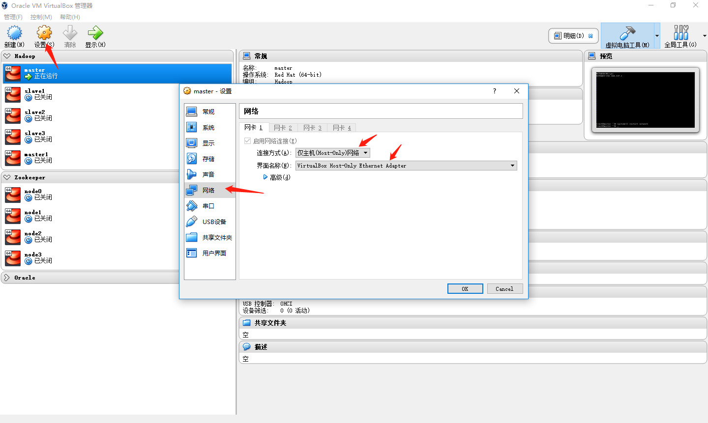
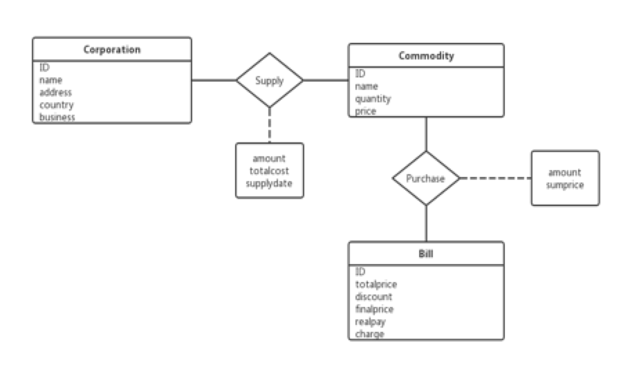
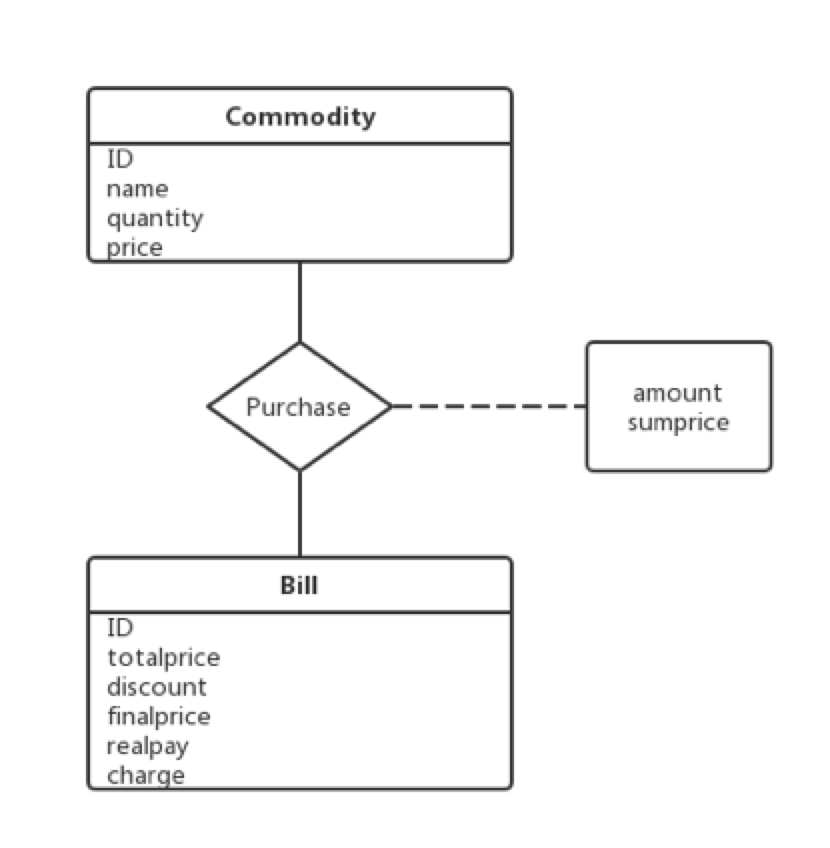
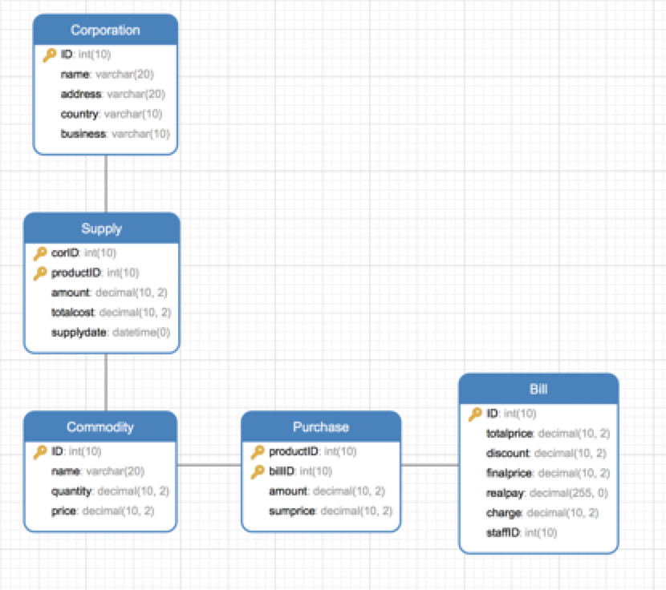

# 云计算期末项目文档


## 系统架构

### 集群架构图



### <a name="a1">集群机器</a>

| 主机名  | 内存 |       IP        |       软件        |                           运行进程                           |
| :-----: |  :-----: | :-------------: | :---------------: | :----------------------------------------------------------: |
|  node0  |  512MB  | 192.168.137.200 |     ZooKeeper     |                        QuorumPeerMain                        |
|  node1  |  512MB  | 192.168.137.201 |     ZooKeeper     |                        QuorumPeerMain                        |
|  node2  |  512MB  | 192.168.137.202 |     ZooKeeper     |                        QuorumPeerMain                        |
| master  |  2GB  | 192.168.137.100 | Hadoop,Hive,MySql | JournalNode,NameNode,ResourceManager,<br/>DFSZKFailoverController,HiveServer2,MySql |
| master1 |  2GB  | 192.168.137.10  |    Hadoop,Hive    | JournalNode,NameNode,ResourceManager,<br/>DFSZKFailoverController,HiveServer2 |
| slave1  |  1GB  | 192.168.137.101 |      Hadoop       |               JournalNode,DataNode,NodeManager               |
| slave2  |  1GB  | 192.168.137.102 |      Hadoop       |                     DataNode,NodeManager                     |
| slave3  |  1GB  | 192.168.137.103 |      Hadoop       |                     DataNode,NodeManager                     |
|  host   |  8GB  |  192.168.137.1  |    应用服务器     |                                                              |

## 集群搭建

### 简介

集群使用VirtualBox创建了8台虚拟机模拟真实环境中的分布式集群<sub>~~(因机器内存不够，特地为此买了内存条及SSD)~~</sub>，虚拟机全部使用CentOS7-x86_64系统，其中3台ZooKeeper集群，5台Hadoop集群（2台Master，3台Slave），Windows本机作为应用程序服务器用于连接此集群。

### 虚拟机创建

此集群中机器的系统基本配置几乎是一样的，只是在后期所担任的角色不同，因此这里我创建了一台虚拟机，而后将环境配好后复制了7台，而后针对其所担任角色进行针对性修改。

首先创建了一台裸机，要解决的第一个问题是虚拟机与主机的网络通信，这里我采用VirtualBox中的`Host-Only`连接方式，以保证虚拟机与主机之间正常的网络通信，同时需要在主机上共享网络，以保证虚拟机同时还能访问互联网。

在主机网络设置中共享网络：



在VirtualBox中执行以下操作设置主机连接方式：



在虚拟机终端执行以下操作：

```sh
# 修改虚拟机的IP、子网掩码
vim /etc/sysconfig/network-scripts/ifcfg-enp0s3
# 修改为以下内容
TYPE=Ethernet
IPADDR=192.168.137.100
NETMASK=255.255.255.0
# 保存退出
# 修改网关地址
vim /etc/sysconfig/network
# 修改为以下内容
NETWORKING=yes
GATEWAY=192.168.137.1
# 保存退出
# 修改主机名为master，后续过程中访问本机只需要主机名而不用敲IP
hostnamectl set-hostname master
# 关闭并停用防火墙，由于这里使用的是局域网，因此无需太多考虑网络安全
systemctl stop firewalld
systemctl disable firewalld
# 重启网络服务
systemctl restart network
# 尝试从虚拟机ping网关以及从主机ping虚拟机hostname或者ip，若都能ping通说明网络配置成功
ping 192.168.137.1
# 从虚拟机ping外网查看是否可以连接互联网，这里测试百度IP：61.135.169.105
ping 61.135.169.105
# 修改hosts文件，添加局域网中其他主机的主机名与ip的映射
vim /etc/hosts
# 修改为以下内容
192.168.137.100 master
192.168.137.10 master1
192.168.137.101 slave1
192.168.137.102 slave2
192.168.137.103 slave3
192.168.137.200 node0
192.168.137.201 node1
192.168.137.202 node2
0.0.0.0 localhost
# 保存退出
```

至此，虚拟机网络配置已完成，下面安装Hadoop 2.9.2及Hive 2.3.4（下载、解压步骤省略），并执行一些准备工作：

```sh
# 首先添加Hadoop和Hive相关环境变量
vim /etc/profile
# 添加下列内容
export HADOOP_MAPRED_HOME=/usr/local/hadoop
export HADOOP_HOME=/usr/local/hadoop
export HADOOP_CONF_DIR=$HADOOP_HOME/etc/hadoop
export HIVE_HOME=/usr/local/hive
export PATH=$HIVE_HOME/bin:$HADOOP_HOME/bin:$HADOOP_HOME/sbin:$PATH
# 保存退出，并使环境变量生效
source /etc/profile
```

Hadoop和Hive的配置需放到各台虚拟机上分别执行，因为不同虚拟机所需要的配置不同。

### 虚拟机复制

上述步骤已经创建好了一个虚拟机，下面需要复制出7个，并对每台机器针对性的进行一些修改。

#### 网络配置

对于每台虚拟机需要执行以下几个步骤以保证9台机器之间形成一个网络：

- 修改IP

  ```sh
  vim /etc/sysconfig/network-scripts/ifcfg-enp0s3
  ```

  针对<a href="#a1">集群机器</a>中定义的IP将`IPADDR`项修改为对应的IP

- 修改主机名

  ```sh
  hostnamectl set-hostname XXX
  ```

  针对<a href="#a1">集群机器</a>中定义的主机名执行以上命令修改为特定的主机名

- 重启网络服务

  ```sh
  systemctl restart network
  ```
  
- ping各个节点测试是否成功

  ```sh
  ping master
  ping master1
  ping slave1
  ping slave2
  ping slave3
  ping node0
  ping node1
  ping node2
  ping 192.168.137.1
  ping 61.135.169.105
  ```

#### Hadoop配置

##### 修改core-site.xml

```sh
vim $HADOOP_HOME/etc/hadoop/core-site.xml
```

- 作用：Hadoop集群的核心配置文件

- 需要修改的机器：master、master1、slave1、slave2、slave3

- 内容：

  ```xml
  <configuration>
          <property>
                  <name>fs.defaultFS</name>
                  <value>hdfs://ns</value>
          </property>
          <property>
                  <name>hadoop.tmp.dir</name>
                  <value>/var/hadoop</value>
          </property> 
          <property>
                  <name>dfs.permissions.enabled</name>
                  <value>true</value>
          </property> 
          <!-- 指定zookeeper地址 -->
          <property>
                  <name>ha.zookeeper.quorum</name>
                  <value>node0:2181,node1:2182,node2:2181</value>
          </property>
      	<!-- 允许访问此hdfs的主机和群组，此处设置为任意 -->
          <property>
                  <name>hadoop.proxyuser.root.hosts</name>
                  <value>*</value>
          </property>
          <property>
                  <name>hadoop.proxyuser.root.groups</name>
                  <value>*</value>
          </property>
  </configuration>
  ```

##### 修改hdfs-site.xml

```sh
vim $HADOOP_HOME/etc/hadoop/hdfs-site.xml
```

-  作用：hdfs集群配置文件

-  需要修改的机器：master、master1、slave1、slave2、slave3

- 内容：

  ```xml
  <configuration>
      	<!-- 指定dfs文件存储位置 -->
          <property>
                  <name>dfs.data.dir</name>
                  <value>/var/hadoop-data</value>
          </property>
      	<!-- 指定文件备份份数 -->
          <property>
                  <name>dfs.replication</name>
                  <value>2</value>
          </property>
      	<!-- 指定机器运行情况检查时间间隔 -->
          <property>
                  <name>dfs.namenode.heartbead.recheck-interval</name>
                  <value>3000000ms</value>
          </property>
          <!-- 指定hdfs的nameservice为ns，和core-site.xml保持一致 -->
          <property>
                  <name>dfs.nameservices</name>
                  <value>ns</value>
          </property>
          <!-- NS下面的NameNode -->
          <property>
                  <name>dfs.ha.namenodes.ns</name>
                  <value>nn1,nn2</value>
          </property>
          <!-- nn1的RPC通信地址 -->
          <property>
                  <name>dfs.namenode.rpc-address.ns.nn1</name>
                  <value>master:9000</value>
          </property>
          <!-- nn1的http通信地址 -->
          <property>
                  <name>dfs.namenode.http-address.ns.nn1</name>
                  <value>master:50070</value>
          </property>
          <!-- nn2的RPC通信地址 -->
          <property>
                  <name>dfs.namenode.rpc-address.ns.nn2</name>
                  <value>master1:9000</value>
          </property>
          <!-- nn2的http通信地址 -->
          <property>
                  <name>dfs.namenode.http-address.ns.nn2</name>
                  <value>master1:50070</value>
          </property>
          <!-- 指定NameNode的元数据在JournalNode上的存放位置 -->
          <property>
                  <name>dfs.namenode.shared.edits.dir</name>
                  <value>qjournal://master:8485;master1:8485;slave1:8485/ns</value>
          </property>
          <!-- 指定JournalNode在本地磁盘存放数据的位置 -->
          <property>
                  <name>dfs.journalnode.edits.dir</name>
                  <value>/usr/local/hadoop/journaldata</value>
          </property>
      	<!-- 开启机器故障自动切换主从机器 -->
          <property>
                  <name>dfs.ha.automatic-failover.enabled</name>
                  <value>true</value>
          </property>
      	<!-- 指定failover切换的方法(java类的名称) -->
          <property>
                  <name>dfs.client.failover.proxy.provider.ns</name>
              <value>org.apache.hadoop.hdfs.server.namenode.ha.ConfiguredFailoverProxyProvider</value>
          </property>
      	<!-- 指定failover切换的方法，这里使用ssh通信方式交换 -->
          <property>
                  <name>dfs.ha.fencing.methods</name>
                  <value>
                  sshfence
                  shell(/bin/true)
                  </value>
          </property>
      	<!-- ssh切换方法需要指定私钥文件位置 -->
          <property>
                  <name>dfs.ha.fencing.ssh.private-key-files</name>
                  <value>/root/.ssh/id_rsa</value>
          </property>
  </configuration>
  ```

-  注意

   -  假设当备份份数为2时，现在有三台DataNode机器，文件被分为2个block，block1位于1和2上，block2位于1和3上，这是若机器3宕机了，hdfs会在设定的`dfs.namenode.heartbead.recheck-interval`时间间隔内检查出机器3(在此时间间隔内可能会出现文件数量紊乱的现象)，此时block2数量变为1，hdfs会自动将1中的block2复制一份到另外一台可用机器上（此处为2）。当机器3恢复运行时，3中备份的block2会自动删除。
   -  当使用jdbc访问hdfs时，不会使用`hdfs-site.xml`中的`dfs.replication`，而会默认使用3，可在java的`configuration`中配置为指定值

##### 修改slaves文件

```sh
vim $HADOOP_HOME/etc/hadoop/slaves
```

- 作用：为各个master指定为其工作的slave

- 需要修改的机器：master、master1

- 内容

  ```txt
  slave1
  slave2
  slave3
  ```

##### 修改yarn-site.xml

```sh
vim $HADOOP_HOME/etc/hadoop/yarn-site.xml
```

- 作用：yarn集群的核心配置文件

- 需要修改的机器：master、master1、slave1、slave2、slave3

- 内容：

  ```xml
  <configuration>
      <!-- 启用yarn集群的高可用机制 -->
      <property>
          <name>yarn.resourcemanager.ha.enabled</name>
          <value>true</value>
      </property>
      <!-- 指定ResourceManager集群id，可为任意字串 -->
      <property>
          <name>yarn.resourcemanager.cluster-id</name>
          <value>yrc</value>
      </property>
      <!-- 指定两台ResourceManager的名称 -->
      <property>
          <name>yarn.resourcemanager.ha.rm-ids</name>
          <value>rm1,rm2</value>
      </property>
      <!-- 指定两台ResourceManager的主机名 -->
      <property>
          <name>yarn.resourcemanager.hostname.rm1</name>
          <value>master</value>
      </property>
      <property>
          <name>yarn.resourcemanager.hostname.rm2</name>
          <value>master1</value>
      </property>
      <!-- 指定两台ResourceManager的web端口，正常情况为8088 -->
      <property>
          <name>yarn.resourcemanager.webapp.address.rm1</name>
          <value>master:8088</value>
      </property>
      <property>
          <name>yarn.resourcemanager.webapp.address.rm2</name>
          <value>master1:8088</value>
      </property>
      <!-- 指定管理集群的Zookeeper集群的地址及对应端口 -->
      <property>
          <name>yarn.resourcemanager.zk-address</name>
          <value>node0:2181,node1:2181,node2:2181</value>
      </property>
      <property>
          <name>yarn.nodemanager.aux-services</name>
          <value>mapreduce_shuffle</value>
      </property>
      <property>
          <name>yarn.nodemanager.auxservices.mapreduce.shuffle.class</name>
          <value>org.apache.hadoop.mapred.ShuffleHandler</value>
      </property>
      <!-- 指定jar包路径 -->
      <property>
          <name>yarn.application.classpath</name>
          <value>/usr/local/hadoop/etc/hadoop:/usr/local/hadoop/share/hadoop/common/lib/*:/usr/local/hadoop/share/hadoop/common/*:/usr/local/hadoop/share/hadoop/hdfs:/usr/local/hadoop/share/hadoop/hdfs/lib/*:/usr/local/hadoop/share/hadoop/hdfs/*:/usr/local/hadoop/share/hadoop/yarn:/usr/local/hadoop/share/hadoop/yarn/lib/*:/usr/local/hadoop/share/hadoop/yarn/*:/usr/local/hadoop/share/hadoop/mapreduce/lib/*:/usr/local/hadoop/share/hadoop/mapreduce/*:/usr/local/hadoop/contrib/capacity-scheduler/*.jar</value>
      </property>
  </configuration>
  ```

##### 修改mapred-site.xml

- 作用：指定MapReduce操作的基本属性

- 需要修改的机器：master、master1

- 内容

  ```xml
  <configuration>
  <property>
      <name>mapreduce.framework.name</name>
      <value>yarn</value>
  </property>
  <property>
      <name>mapreduce.application.classpath</name>
      <value>/usr/local/hadoop/etc/hadoop:/usr/local/hadoop/share/hadoop/common/lib/*:/usr/local/hadoop/share/hadoop/common/*:/usr/local/hadoop/share/hadoop/hdfs:/usr/local/hadoop/share/hadoop/hdfs/lib/*:/usr/local/hadoop/share/hadoop/hdfs/*:/usr/local/hadoop/share/hadoop/yarn:/usr/local/hadoop/share/hadoop/yarn/lib/*:/usr/local/hadoop/share/hadoop/yarn/*:/usr/local/hadoop/share/hadoop/mapreduce/lib/*:/usr/local/hadoop/share/hadoop/mapreduce/*:/usr/local/hadoop/contrib/capacity-scheduler/*.jar</value>
  </property>
  </configuration>
  ```

- 注意：

  - MapReduce是不一定依赖yarn的，但一般使用yarn框架来实现MapReduce
  - 此项若是不配，一些job只会在本机跑，而不会分发给其他机器

##### 修改hive-site.xml

```sh
vim $HIVE_HOME/conf/hive-site.xml
```

- 作用：hive的基本配置

- 需要修改的机器：master、master1

- 内容：

  - 修改`hive.server2.webui.host`

      ```xml
      <property>
          <name>hive.server2.webui.host</name>
          <value>${hostname}</value>
          <description>The host address the HiveServer2 WebUI will listen on</description>
      </property>
      ```

      其中`${hostname}`需要改成对应的主机名称(master与master1)，或者都改为`0.0.0.0`

  - 修改`hive.server2.bind.host`

      ```xml
      <property>
          <name>hive.server2.thrift.bind.host</name>
          <value>${hostname}</value>
          <description>Bind host on which to run the HiveServer2 Thrift service.</description>
      </property>
      ```

      其中`${hostname}`需要改成对应的主机名称(master与master1)，或者都改为`0.0.0.0`

  - 修改`hive.server2.zookeeper.namespace`

      ```xml
      <property>
          <name>hive.server2.zookeeper.namespace</name>
          <value>hiveserver2</value>
          <description>The parent node in ZooKeeper used by HiveServer2 when supporting dynamic service discovery.</description>
      </property>
      ```

      注意两个hiveserver节点的该值应设置为一样，指定了改值后，每当一个hiveserver节点启动时，在Zookeeper集群中，目录树下的hiveserver2文件夹下就可以看到该节点注册到Zookeeper中。

  - 修改`javax.jdo.option.ConnectionURL`、`javax.jdo.option.ConnectionPassword`和`javax.jdo.option.ConnectionDriverName`

      ```xml
      <property>
          <name>javax.jdo.option.ConnectionURL</name>
              <value>jdbc:mysql://master:3306/hive?createDatabaseIfNotExist=true&amp;useSSL=false&amp;allowPublicKeyRetrieval=true</value>
          <description>
            JDBC connect string for a JDBC metastore.
            To use SSL to encrypt/authenticate the connection, provide database-specific SSL flag in the connection URL.
            For example, jdbc:postgresql://myhost/db?ssl=true for postgres database.
          </description>
      </property>
      <property>
          <name>javax.jdo.option.ConnectionPassword</name>
              <value>root</value>
          <description>password to use against metastore database</description>
      </property>
      <property>
          <name>javax.jdo.option.ConnectionDriverName</name>
              <value>com.mysql.jdbc.Driver</value>
          <description>Driver class name for a JDBC metastore</description>
      </property>
      ```

      这里两个节点的数据库连接字符串也应该是一样的，需要知道的是这里只有master节点安装并运行了mysql服务，存储hive元数据的均在此mysql数据库中，意即存储元数据信息是与master1无关的，实际上mysql服务器可以在网络上的任意位置(~~此处我一开始也误解了，以为master和master1节点都需要存储hive的元数据~~)。

      另外，mysql的连接jar包需要下载并复制到hive的lib目录下。

至此整个Hadoop集群已经搭建完毕，却未完，需要使用Zookeeper集群来实现集群的高可用性（HA）。

#### Zookeeper配置

对于剩下的node0、node1、node2三台机器是用于搭建Zookeeper集群的，因此需要安装并配置Zookeeper-3.4.10：

```sh
vim /usr/local/zookeeper/conf/zoo.cfg
# 添加一下内容
server.1=192.168.137.200:2888:3888
server.2=192.168.137.201:2888:3888
server.3=192.168.137.202:2888:3888
# 保存并关闭
```

#### ssh免密登录配置

- 作用：保证任何一台机器都可通过ssh免密访问其他机器，这对于使用sshfence策略的failover机制是很必要的

- 需要修改的机器：所有机器

- 内容：

  ```sh
  # 进入用户目录下的`.ssh`目录
  cd
  cd .ssh/
  # 创建公钥私钥对
  ssh-keygen -t rsa
  # 将公钥发送给其他所有节点，hostname需对应每一台机器更改为其主机名执行一遍
  ssh-copy-id ${hostname}
  ```

至此，Hadoop集群与Zookeeper集群已搭建完毕，接下来需要启动之。

### 集群启动

#### 初始化数据库

在master机器上执行以下操作以初始化数据库：

```sh
cd $HIVE_HOME
schematool -initSchema -dbType mysql
```

此命令执行完之后将会在mysql中创建hive的元数据表，以存储hive的表结构及其他属性。

#### 启动集群

在master机器上执行以下操作以启动集群：

```sh

```

## 项目功能需求

### 项目主题

**超市销售管理系统**

### 功能简介

#### 商品进货

**功能点说明**：超市管理员查询供应商，并根据结果输入从该供应商进货的商品信息

**数据需求**：查询供应商，新增进货记录，新增商品

#### 查询商品

**功能点说明**：超市管理员通过商品名搜索库存中的所有相关商品

**数据需求**：查询商品

#### 生成订单

功能点说明：超市管理员查询相应商品并将其添加至订单中，添加完毕后生成订单

数据需求：查询商品，新增购买记录，新增订单

### 概念设计

基于面向对象的思想，我们在分析数据需求的时候简单地将我们的系统分为两个模块：进货和购买，这两个模块都以商品为核心。因此在构建实体-联系模型时，我们也根据这个思想出发，将E-R图分为了两个模块。

#### 总体E-R图



#### 进货模块E-R图


进货模块主要包含两个实体集，公司（Corporation）和商品（Commodity）。商品中包含着超市库存商品的信息如商品名称、数量、价格，公司类包含供应商的信息如公司名称、地址、国家等。两个实体之间有着关系集供应（Supply），表示某商品从某公司进货。由于一种商品可能从多个公司进货，一个公司也可能供应多种商品，因此他们之间的关系应该是多对多。供应关系集同时还具有属性，表示进货的信息包括数量、成本、时间。

#### 购买模块E-R图



购买模块包含的实体集有商品（Commodity）和订单（Bill）。订单表示一次完整购买的总订单（包含购买的所有商品情况），包含的信息有总价、折扣、实际价格等。商品和订单之间有关系集购买（Purchase），由于一个订单包含多个商品，一个商品也会被多次购买，因此这个关系是多对多的。同时，购买关系还具有属性，表示订单中的每一种商品购买的数量和小计价格。

### 逻辑设计

#### 表设计

根据E-R模型的转化，我们生成了5张表，分别是：Corporation（公司），Supply（供应），Commodity（商品），Purchase（购买），Bill（订单）。表的详细设计如下：

###### Commodity表

| 字段名   | 数据类型 | 长度 | 说明       | 备注 |
| -------- | -------- | ---- | ---------- | ---- |
| ID       | number   | 10   | 商品的ID   | PK   |
| name     | varchar  | 20   | 商品名称   |      |
| quantity | decimal  | 10,2 | 商品库存量 |      |
| price    | decimal  | 10,2 | 商品单价   |      |

###### Corporation表

| 字段名   | 数据类型 | 长度 | 说明         | 备注 |
| -------- | -------- | ---- | ------------ | ---- |
| ID       | number   | 10   | 公司的ID     | PK   |
| name     | varchar  | 20   | 公司名称     |      |
| address  | varchar  | 20   | 公司地址     |      |
| country  | varchar  | 10   | 公司所在国家 |      |
| business | varchar  | 10   | 公司业务     |      |

###### Bill表

| 字段名     | 数据类型 | 长度 | 说明         | 备注 |
| ---------- | -------- | ---- | ------------ | ---- |
| ID         | number   | 10   | 订单的ID     | PK   |
| totalprice | decimal  | 10,2 | 订单总价     |      |
| discount   | decimal  | 10,2 | 订单折扣     |      |
| finalprice | decimal  | 10,2 | 订单实际总价 |      |
| realpay    | decimal  | 10,2 | 顾客付款     |      |
| charge     | decimal  | 10,2 | 找钱         |      |

###### Supply表

|  字段名   | 数据类型 | 长度 | 说明           | 备注                            |
| :---------- | :--------- | ---- | :---------------- | --------------------------- |
|   corID   | number   | 10   | 供应公司的ID   | PK;   FK，参照于Corporation的ID |
| productID | number   | 10   | 商品的ID       | PK；FK，参照于Commodity的ID     |
|  amount   | decimal  | 10,2 | 商品供应数量   |                                 |
| totalcost | number   | 6    | 商品供应总成本 |                                 |
| supplydate | datetime | 0 | 供应日期 |  |

###### Purchase表

| 字段名    | 数据类型 | 长度 | 说明               | 备注                    |
| --------- | -------- | ---- | ------------------ | ----------------------- |
| productID | number   | 10   | 购买商品的ID      | PK；参照于Commodity的ID |
| billID    | number   | 10   | 订单ID           | PK；参照于Bill的ID      |
| amount    | decimal  | 10,2 | 购买该商品数量     |                         |
| sumprice  | decimal  | 10,2 | 购买该商品小计价格 |                         |

#### 数据库关系图

根据表的设计和之间的外码约束，绘制出数据库的关系图：



### Hive中的实际存储

经过多次尝试与实验，发现Hive中实际上是不支持表间外键联系的，因此我们在实际存储上述的表结构时将所有的外键均去除了。

> 这引出了数据仓库在实际应用中的一种常见处理方式：为了提高速度而产生数据冗余。Hive中的表结构的特殊性，使得使用人员方便针对各种功能设计所需的信息表，而非使用传统的符合3NF或者其他范式的表结构，这也是数据仓库作为大量数据集的OLAP最佳选择的原因之一(其消除了由于大量表间连接时而产生的冗余操作，这是很典型的以**空间**换取**时间**的策略)。

## 项目实现方法

整个项目我们使用传统的JavaWeb框架。后端使用Servlet处理数据交互，使用JDBC连接Zookeeper管理的Hiveserver2集群；前端使用Bootstrap框架完成基本的项目展示功能：


​											图1：查看库存


​											图2：查看历史账单


​											图3：创建新账单

我们深知本项目重点在分布式集群而非前端展示上，因此我们组将95%的精力放在项目的理论理解、环境搭建、性能提升以及实践使用上。

## 项目亮点

### HA的原理理解及实现

HA的实现是我们组在搭建集群时遇到的最大的难题，如何协调其主次关系、如何保证网络通信、如何确定哪些进程应该运行在哪些合适的机器上，举个例子：在我们完成集群搭建到了最后启动Hive时，启动了两个Hive客户端进程和两个Hiveserver2服务端进程，而两个Hive客户端又共用了同一个MySQL服务器，导致jdbc在连接Zookeeper时会随机访问到两个Hive客户端，这导致了数据库数据时而一致、时而不一致，后来我们在Hive的配置文件将其连接Hive客户端改为同一个后将其解决了。诸如此类的小问题我们遇到了很多很多，最后都一一得到了解决。

### Hive与MySQL的横向对比

我们发现Hadoop集群启动后，前端与后端进行数据交互的速度很慢，于是我们使用MySQL与Hive做了简单的对比，结果很让我们困惑：MySQL的执行时间基本上是远远快于Hive的执行时间的。

我们从以下角度进行了思考与实验：

首先，考虑我们在这两种数据库中执行的操作，如果对于一开始数据从文件进入数据库中这一过程忽略的话，我们整个项目执行的都是OLAP即联机分析处理操作。Hive作为一个经典的数据仓库工具，本身应该是擅长执行OLAP操作的，因此暂且认为"操作"不是造成二者执行时间差异的原因；

其次，Hive官网有句话"Hive在大型数据集上会表现出优越的性能"，考虑到我们的项目数据集中，最多的数据集是数百万条的商品库存数据，我们猜测是数据量限制了Hive体现其优越性。因此我们作了如下实验：将数据量从10W变化到1000W，然后观察在等量的数据量变化上，二者执行时间的变化，得到下表：

| 数据库类型     | 10W数据 | 1000W数据 |
| -------------- | ------: | :-------: |
| MySQL          |     9ms |   271ms   |
| Hive(textfile) |  1428ms |  5100ms   |

就时间来说，很显然MySQL更胜一筹，但从增长比例来说，MySQL从9ms增长至271ms增长约为30倍，而Hive增长约为5倍，由此我们可窥见Hive在大量数据集时性能会更加优越。

然而在这过程中，我们所使用的Hive所采用的为textfile存储结构，意即内容即文件，表数据完全按照表结构存储成为文本文件。从Hive官方文档我们得知Hive有其他更加优越的存储格式，它包含SequenceFile、RCFile、ORCFile，因此我们采取了所谓最优的ORCFile来Duplicate了用户评论表，想以此对比ORCFile之于TextFile的优点。存储中源数据文件大小为872MB，当使用textfile格式存储时，Hive会将我们导入的文件原封不动的移动到hdfs的Hive数据文件目录下，而使用ORCFile格式存储时文件大小只有260MB大小，这是其优点之一：**文件压缩**。至于性能，我们执行了上述同样的实验：

| 数据库类型     | 10W数据 | 1000W数据 |
| -------------- | ------: | :-------: |
| MySQL          |     9ms |   271ms   |
| Hive(textfile) |  1428ms |  5100ms   |
| Hive(ORC)      |   110ms |   126ms   |

结果显而易见，当数据达到数百万量级时，Hive在存储模式**较优**的使用方法下已经要比MySQL要稍显胜势了。

通过以上两点我们不难总结出以下几点：

- 限制Hive的效率的因素：

  - 数据量

    在百万数据量以下时，Hadoop是很难发挥出其优点的

  - 计算框架

    Hive在我们项目中使用的是MapReduce框架来执行分布式计算，然而比现在已经有很多比MapReduce快得多的计算框架例如Spark等，因此若使用这些框架必定会使Hive执行效率更上一层

  - 网络通信

    由于我们的集群搭建在虚拟机中，其间数据通过真实的网络通信传输，虽然少了中间光纤传递的过程，但是在建立连接到发送数据到取消连接这一过程所耗费的时间都是很难被忽略的，因此生产环境下的Hadoop集群对网络带宽的要求是很高的

- 百万级数据的OLAP场景或者OLTP操作需求较多的场景下，MySQL(关系型数据库)是优选

- 千万乃至亿万级数据的批处理、分析场景，Hive(数据仓库/分布式数据库)在存储、读取、分析效率上都要更优
